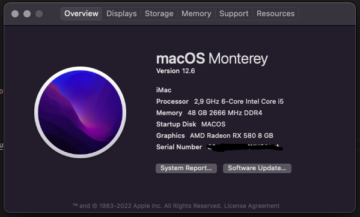

# Hackintosh Monterey

## Hardware


```
Intel i5 9400f
RX580 8gb
48GB RAM
SSD M2 512gb
```

## Install

1. Format USB to FAT32;
2. Run install.sh;
3. Copy folders `EFI` and `com.apple.recovery.boot` to USB;
4. Enjoy;

## OpenCore Install Guide

Link documentation: https://dortania.github.io/OpenCore-Install-Guide/installer-guide/
